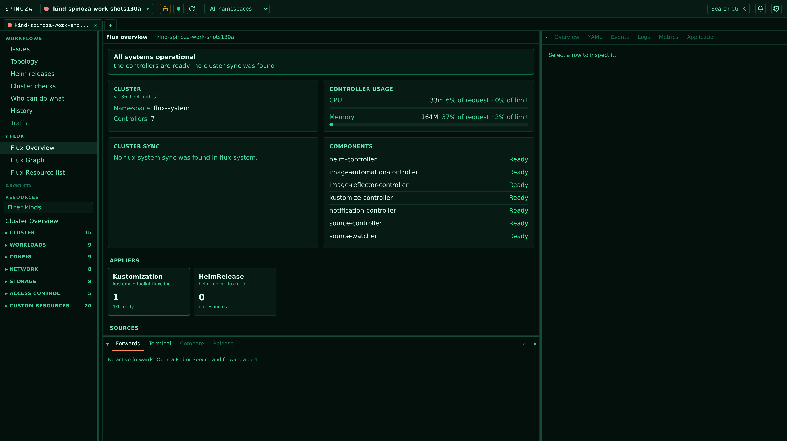
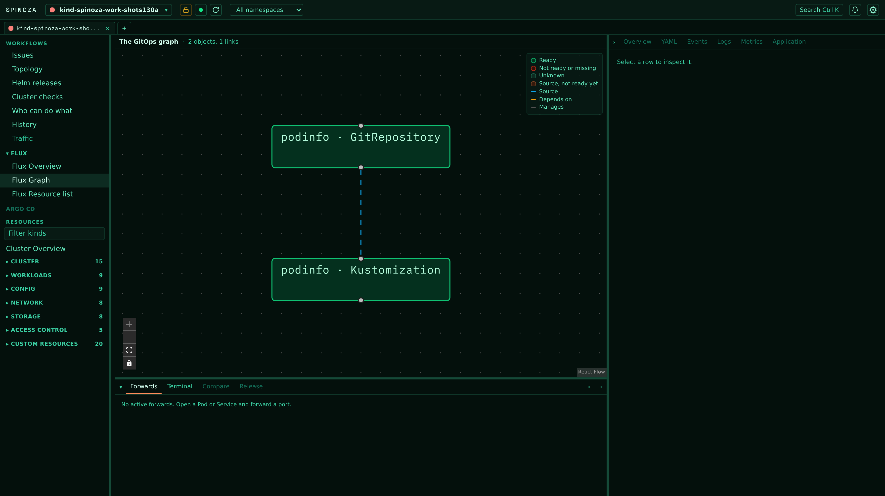
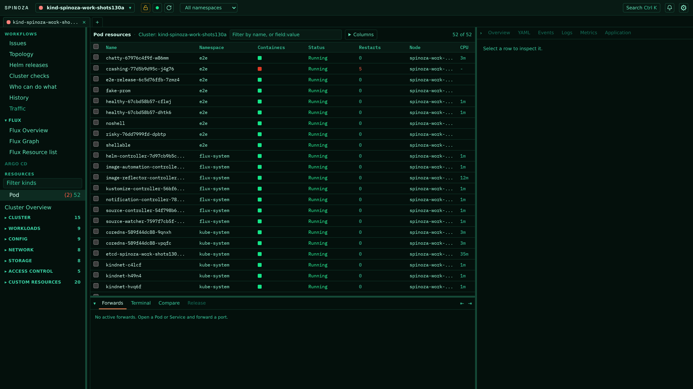
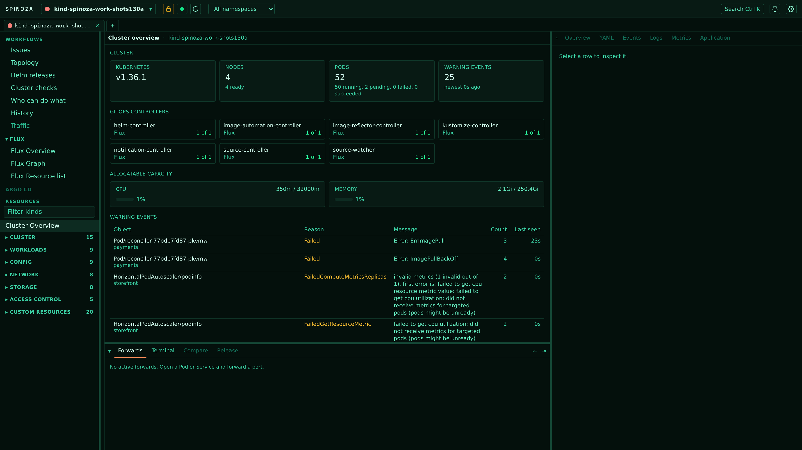

# Spinoza

[](https://github.com/sophotechlabs/spinoza/actions/workflows/go.yaml)
[](https://github.com/sophotechlabs/spinoza/actions/workflows/frontend.yaml)
[](https://github.com/sophotechlabs/spinoza/actions/workflows/repo.yaml)
[](https://github.com/sophotechlabs/spinoza/actions/workflows/go.yaml)
[](https://github.com/sophotechlabs/spinoza/actions/workflows/frontend.yaml)
[](LICENSE)

A self-hosted Kubernetes GUI: Go backend with client-go informers, React frontend, one binary. Runs as a browser tab or a desktop window. [spinoza.tech](https://spinoza.tech)

## Install

```sh
curl -fsSL https://spinoza.tech/download | sh
```

The binary goes to `~/.local/bin`, or `/usr/local/bin` as root; `SPINOZA_INSTALL_DIR` overrides both. Checksums are verified before anything is written. On macOS the desktop app lands in `/Applications`.

```sh
spinoza --open          # browser
open -a Spinoza         # desktop window, macOS
```

Tarballs for Linux, macOS and Windows are on the [releases page](https://github.com/sophotechlabs/spinoza/releases). `SPINOZA_VERSION=v1.5.0` pins the installer.

Spinoza needs a kubeconfig. Helm releases are read straight from the cluster; upgrades, rollbacks and debug containers call `helm` and `kubectl`.

## Screenshots

Live clusters, Borg theme.

**Flux, grouped by role.** Cluster sync from the repository, controller health, and every applier and source with its ready count.



**The dependency graph.** Sources, Kustomizations and HelmReleases, laid out by what manages what. Click a node to open it.



**Pods.** Container health, restarts, node, live CPU and memory. Filter by name or by `field:value`.



**Cluster overview.** Version, node readiness, allocatable capacity against live usage, and the newest warning events.



## What it does

- **Every resource type discovery reports**, in a Lens-style tree. One informer-backed view per GVR; CRDs appear without per-type code.
- **Cluster overview**: server version, node readiness, allocatable CPU and memory against live usage, pods by phase, newest warning events.
- **Helm releases** read from Helm's own storage objects, secrets or configmaps, whichever driver wrote them. Chart, app version, the newest version your repos offer, revision, status, values, notes, rendered manifest and history. Upgrade, rollback and uninstall call `helm`, and an upgrade shows a server-rendered manifest diff before you confirm. A release owned by Flux links to its HelmRelease.
- **GitOps** for Flux and Argo CD: an overview grouped by role, a dependency graph, per-kind lists. Reconcile, suspend and resume Flux objects.
- **Inspect drawer** with metadata, conditions, events, and live YAML edited against the cluster's own schema (Monaco with `monaco-yaml`), server-side apply and delete. An edited draft survives a background reload.
- **Write actions**: scale, rollout restart, cordon, uncordon, drain. Drain plans first and shows what it would evict, skip and refuse.
- **Logs** per container, streamed. Pausing follow stops the scroll, not the stream.
- **Exec** into a container over `v5.channel.k8s.io` in a real terminal. Shell-less images get an ephemeral debug container instead, on a verdict cached per image digest.
- **Port-forwards** to pods or services, listed and stoppable in one place, surviving navigation.
- **Metrics**: live usage from metrics-server in the tables, CPU and memory history from Prometheus through the apiserver proxy. `--prometheus namespace/service:port` overrides discovery.
- **Filtering** by chips: `ns:`, `name:`, or any column of the kind in view, completed from what the cluster reported.

## Running it

Spinoza starts on your current kubeconfig context, and the top bar switches between every context it can see. **Kubeconfigs** adds another file by path, referenced rather than copied or merged, so contexts stay grouped under the file they came from. The list lives in `kubeconfigs.json` in your user config directory. `--kubeconfig PATH` replaces the default lookup for one run.

Spinoza binds loopback only and rejects requests whose Host or Origin is not local. Every route and both WebSockets require the token generated for that run, sent as the `X-Spinoza-Token` header, a `token` query parameter, or the cookie the page keeps. `--token-file PATH` writes it out at mode 0600.

Destructive actions can be put behind a typed confirmation per cluster: delete and apply then ask you to type the object's name first.

## Develop

Toolchain versions are pinned in `mise.toml` (Go 1.26, Node 24); `mise install` gets them.

```sh
just deps      # frontend dependencies, once
just run       # build the frontend and the binary, then start
just dev-api   # Go server on :34115
just dev-web   # Vite, proxying to the API
just rund      # build and open the desktop app
```

Vite serves its own `index.html` without the token, so open `http://localhost:5173/?token=<the token dev-api printed>`.

The binary embeds the built frontend. `just stub-assets` writes a placeholder for the Go-only recipes.

Every check is a `just` recipe: `just check` before pushing, `just ci` for everything CI runs, which adds cross-compilation, the coverage gate, `govulncheck`, dead-code and unused-dependency checks, a bundle-size budget, secret scanning and SAST.

## Architecture

Discovery builds a resource catalog. Each subscribed GVR gets a dynamic informer whose cache is projected into table rows; a WebSocket sends one snapshot and then deltas keyed by uid. Exec and port-forwarding get their own transports: a binary WebSocket carrying the Kubernetes exec channel protocol, and a process-global forward registry independent of any request.

The React app is embedded with `embed.FS`. One HTTP and WebSocket server backs both the browser tab and the desktop window.
