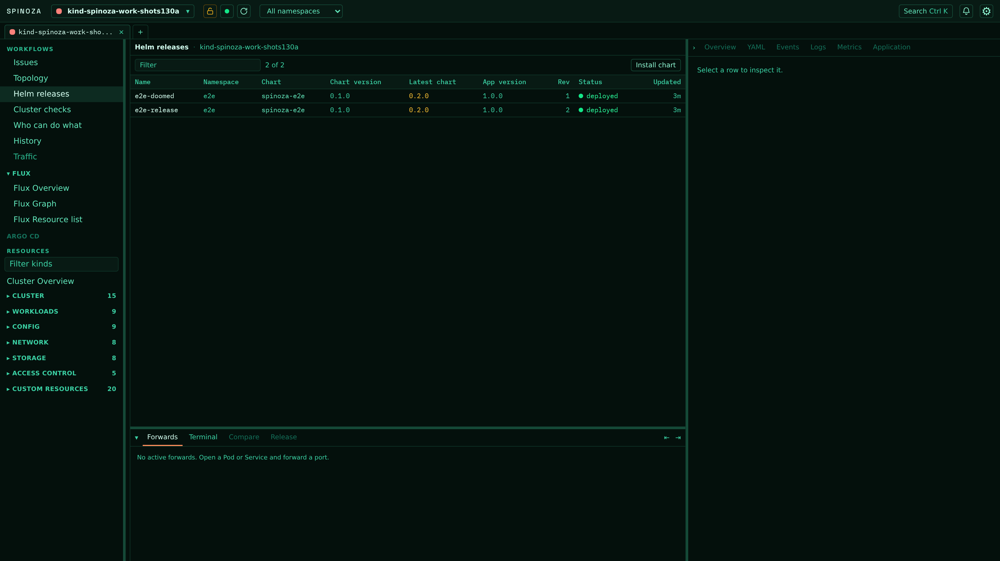
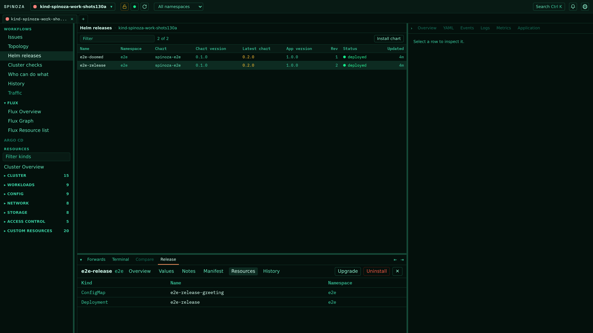
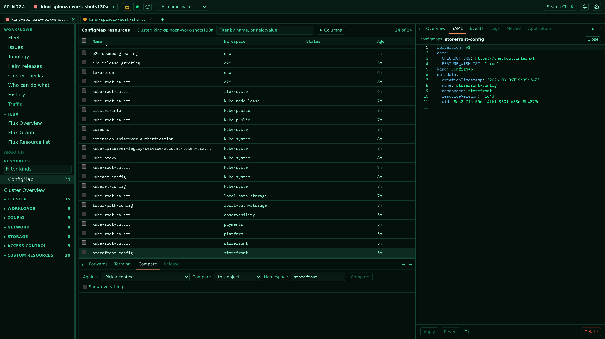
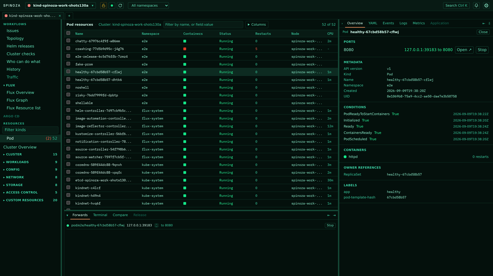
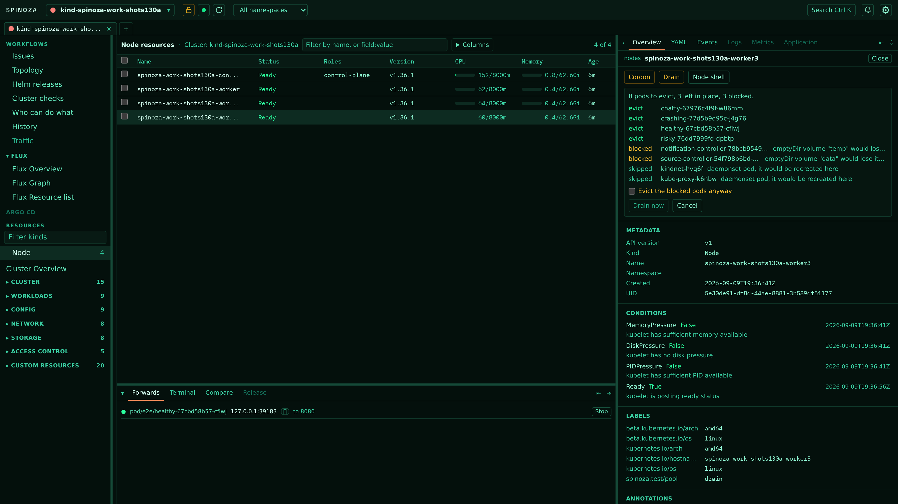

# Spinoza

[](https://github.com/sophotechlabs/spinoza/actions/workflows/go.yaml)
[](https://github.com/sophotechlabs/spinoza/actions/workflows/frontend.yaml)
[](https://github.com/sophotechlabs/spinoza/actions/workflows/repo.yaml)
[](https://github.com/sophotechlabs/spinoza/actions/workflows/go.yaml)
[](https://github.com/sophotechlabs/spinoza/actions/workflows/frontend.yaml)
[](LICENSE)

A self-hosted Kubernetes GUI: Go backend with client-go informers, React frontend, one binary. Runs as a browser tab or a desktop window. [spinoza.tech](https://spinoza.tech)

## Install

macOS and Linux:

```sh
curl -fsSL https://spinoza.tech/install.sh | sh
```

Windows, in PowerShell:

```powershell
irm https://spinoza.tech/install.ps1 | iex
```

The binary goes to `~/.local/bin`, or `/usr/local/bin` as root, and on Windows to `%LOCALAPPDATA%\Programs\spinoza`, which is added to your user `PATH`. `SPINOZA_INSTALL_DIR` overrides all three. Checksums are verified before anything is written. The desktop app lands in `/Applications` on macOS, your launcher on Linux, and an `app` subdirectory on Windows, unless `SPINOZA_SKIP_APP=1`.

```sh
spinoza --open          # browser
open -a Spinoza         # desktop window, macOS
```

Archives are on the [releases page](https://github.com/sophotechlabs/spinoza/releases): tarballs for Linux and macOS, zips for Windows. `SPINOZA_VERSION=v1.8.1` pins the installer.

Nothing is code-signed, so Windows SmartScreen warns on first run: More info, then Run anyway.

Set `SPINOZA_VERIFY_ATTESTATION=1` and both installers check the GitHub build provenance of what they downloaded before writing it, which the checksum alone cannot tell you. It needs `gh` installed and signed in, so it is off by default.

To remove it, on macOS and Linux:

```sh
curl -fsSL https://spinoza.tech/install.sh | SPINOZA_UNINSTALL=1 sh
```

On Windows, in PowerShell:

```powershell
$env:SPINOZA_UNINSTALL=1; irm https://spinoza.tech/install.ps1 | iex
```

Either takes back the binary, the desktop app and its launcher entry, and on Windows the `PATH` entry too. Your settings and kubeconfigs are left alone, and so is the directory the binary sat in.

Needs a kubeconfig. Upgrades, rollbacks and debug containers call `helm` and `kubectl`.

## Every GVR discovery reports

One informer-backed view per type, so CRDs need no per-type code. Snapshot, then deltas over a WebSocket keyed by uid. Field-aware filter completed from what the cluster reported, namespace scope, failing-object badges, bulk restart and delete.


## GitOps

Flux and Argo CD side by side: cluster sync, controller health, per-kind lists, status tiles. Reconcile, suspend and resume Flux objects. Sync and refresh Argo Applications.


The dependency graph is laid out by what manages what. Argo's is the app-of-apps, ApplicationSets above what they generate. A node opens in the drawer with its actions.


## Helm without the binary

Releases read from Helm's own storage, either driver. Chart and app version, what your repos offer, revision, status, values, notes, rendered manifest, history. OCI end to end. Upgrade behind a server-rendered manifest diff; rollback and uninstall from the same panel. A Flux-owned release links to its HelmRelease instead of offering an upgrade button.



Selecting a release docks its detail as a panel. Drag it to any side, resize it, collapse it; the placement persists, and `release` and `releaseNs` in the URL carry it through a reload or a back button. Clicking a rendered resource opens that object in its own table with the row selected and the drawer open, while the release stays docked underneath.



## Inspect and edit

Metadata, conditions, events and live YAML in Monaco. Schema-aware completion from the cluster's own OpenAPI, server-side apply and delete. An edited draft survives a background reload.



## Port-forwarding

Any pod or service on localhost, no kubectl. Forwards survive navigation, listed and stopped from one panel.



## Write actions

Scale, rollout restart, cordon, uncordon, drain. Drain shows its eviction plan before it runs: what it evicts, what it leaves, what it blocks and why. Protected clusters require the object name typed out.



## Also

- **Cluster overview**: server version, node readiness, allocatable against live usage, pods by phase, recent warning events.
- **Exec** over `v5.channel.k8s.io` into xterm. Shell-less images get an ephemeral debug container, on a verdict cached per image digest.
- **Logs** per container. Pausing follow stops the scroll, not the stream.
- **Metrics**: metrics-server in the tables, CPU and memory history from Prometheus through the apiserver proxy. `--prometheus namespace/service:port` overrides discovery. With no Prometheus to ask, spinoza samples metrics-server itself while the window is open and says so on the chart.
- **Update check**: asks spinoza.tech once per run whether a newer release exists, and offers the install command if so. It never installs anything.
- **Kubeconfigs** added by path, referenced in place, never copied or merged. Contexts grouped per file, listed in `kubeconfigs.json`. `--kubeconfig PATH` replaces the default lookup for one run.
- **Nine themes**, contrast-gated in CI, plus your own as JSON. Screenshots here are Borg.

## Security

Binds loopback only; rejects non-local Host or Origin. Every route and both WebSockets require the token minted for that run, as the `X-Spinoza-Token` header, a `token` query parameter, or the cookie the page keeps. `--token-file PATH` writes it at mode 0600. Exits when the last view closes.

Outbound: your apiserver, the chart repos you configured, and one request per run to spinoza.tech asking whether a newer release exists.

## Develop

Toolchain pinned in `mise.toml` (Go 1.26, Node 24); `mise install` gets them.

```sh
just deps      # frontend dependencies, once
just run       # build the frontend and the binary, then start
just dev-api   # Go server on :34115
just dev-web   # Vite, proxying to the API
just rund      # build and open the desktop app
```

Vite serves its own `index.html` without the token, so open `http://localhost:5173/?token=<the token dev-api printed>`.

The binary embeds the built frontend; `just stub-assets` writes a placeholder for the Go-only recipes.

`just check` before pushing. `just ci` runs everything CI does: cross-compilation, the coverage gate, `govulncheck`, dead-code and unused-dependency checks, a bundle-size budget, secret scanning and SAST.

## Architecture

Discovery builds a resource catalog. Each subscribed GVR gets a dynamic informer whose cache is projected into table rows; a WebSocket sends one snapshot then deltas keyed by uid. Informers strip managedFields before caching. Exec and port-forwarding get their own transports: a binary WebSocket carrying the Kubernetes exec channel protocol, and a process-global forward registry independent of any request.

The React app is embedded with `embed.FS`. One HTTP and WebSocket server backs both the browser tab and the desktop window, and you move between them mid-session.

Built on client-go v0.36, so Kubernetes 1.35 to 1.37 by skew policy. Runs in production against k3s v1.36.
